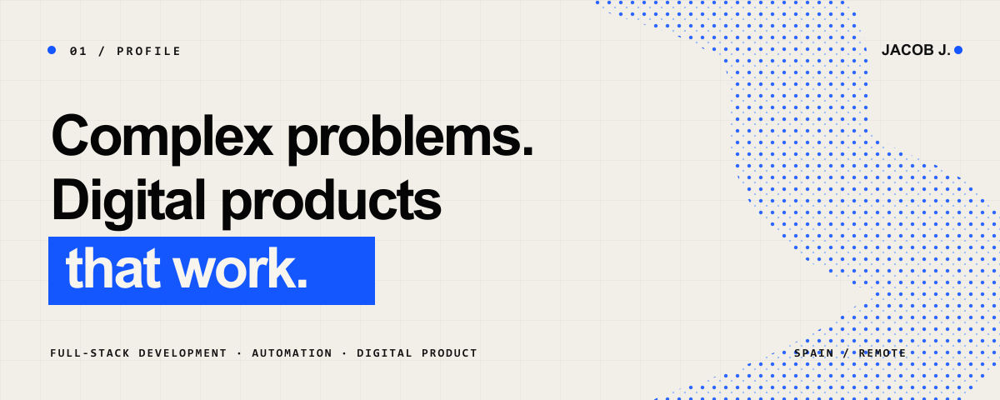

<p align="center">
  <strong>JACOBO JIMÉNEZ</strong> · @ITSJAYCO · SPAIN / REMOTE<br>
  <a href="mailto:jacobojimenez08@gmail.com">EMAIL</a> ·
  <a href="https://www.linkedin.com/in/dev-jacobojimenez/">LINKEDIN</a> ·
  <a href="https://wa.me/34666523136">WHATSAPP</a>
</p>

---

## `02 / POSITION`


# I build the visible—and the systems that make it work.

I'm **Jacob J.**, a full-stack developer with more than six years of experience
turning complex ideas and inefficient processes into clear, maintainable
digital products.

I work across product thinking, interface design and software engineering. That
means I can help shape the right solution before writing the code—and carry it
all the way to production.

**Currently available for selected projects.**

<br clear="right">

---

## `03 / CAPABILITIES`

| 01 | 02 | 03 |
|---|---|---|
| **Web & product** | **Automation** | **Custom software** |
| Websites, platforms and interfaces built around a real business objective. | Integrations and workflows that remove repetitive work and connect existing tools. | Internal systems, dashboards and products designed for the way a company actually operates. |

```text
UNDERSTAND  →  SIMPLIFY  →  DESIGN  →  BUILD  →  MEASURE  →  IMPROVE
```

---

## `04 / EXPERIENCE`

| 6+ YEARS | END TO END | SPAIN / REMOTE |
|:---|:---|:---|
| Building and shipping software | Strategy, UX, development and delivery | Direct collaboration across teams and time zones |

### The strongest work is not always public.

Most of the products with the greatest business value in my career belong to
companies and clients, so their repositories are private. This profile focuses
on capability and decision-making rather than repository volume.

In a conversation, I can walk through the problems I solved, the decisions I
made, the systems I designed and the outcomes—without exposing confidential
code or company information.

---

## `05 / TOOLKIT`

**Product & interface**

`TypeScript` · `React` · `Next.js` · `Angular` · `Figma`

**Systems & APIs**

`Node.js` · `.NET / C#` · `Python` · `REST APIs` · `PostgreSQL` · `SQL Server`

**Delivery**

`Git` · `Docker` · `Azure` · `AWS` · `CI/CD`

> Tools change. The standard does not: clear thinking, solid execution and software that works.

---

## `06 / CONTACT`

# Have a problem worth solving?

Tell me what you want to improve—even if the technical solution is not clear yet.

[**START A CONVERSATION →**](mailto:jacobojimenez08@gmail.com)

[**jacobj.dev →**](https://jacobj.dev)

---

<sub>Public signature: <strong>Jacob J.</strong> · Professional name: <strong>Jacobo Jiménez</strong> · Technical handle: <strong>@ItsJayco</strong></sub>

---

<sub>Public signature: <strong>Jacob J.</strong> · Professional name: <strong>Jacobo Jiménez</strong> · Technical handle: <strong>@ItsJayco</strong></sub>
